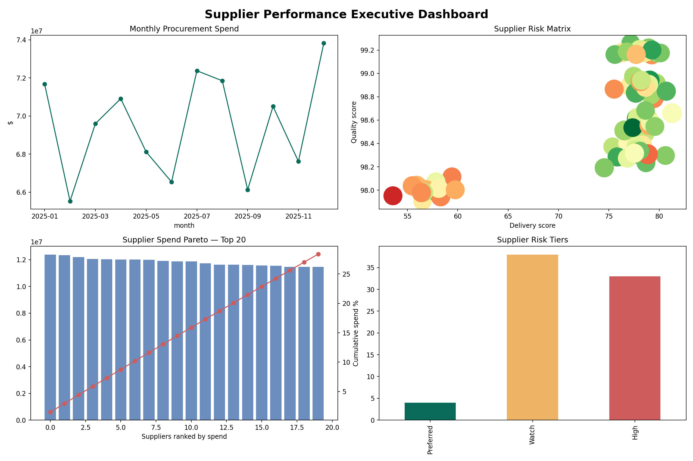

# Supplier Performance & Spend Analysis

Advanced procurement analytics case study evaluating 75 suppliers across cost, delivery, quality, risk, and spend concentration using 50,000 synthetic purchase orders.

> Data note: all records are synthetic and generated for portfolio demonstration.

## Decisions supported

- Identify preferred, watch-list, and high-risk suppliers.
- Compare on-time delivery and defect performance.
- Understand supplier-level spend exposure.
- Create a transparent weighted score: cost 35%, delivery 40%, quality 25%.

## Verified outputs

The full ranking is in [`output/supplier_scorecard.csv`](output/supplier_scorecard.csv), with headline metrics in [`output/executive_summary.csv`](output/executive_summary.csv).



### Portfolio findings

- The analysis evaluates $834.7M in modeled spend across 75 suppliers.
- Network on-time delivery is 74.0%, creating a clear supplier-development opportunity.
- The portfolio contains 33 high-risk suppliers under the transparent weighted methodology.
- Spend Pareto output identifies concentration and negotiation priorities.

## Repository

```text
data/       50K purchase orders and 75-supplier master
sql/        PostgreSQL weighted-score query
src/        Python data generation and analysis
output/     Scorecard, summary, and visualization
```

## Reproduce

```bash
python -m pip install -r requirements.txt
python src/analyze_suppliers.py
```

## Skills demonstrated

Procurement analytics · Supplier segmentation · Spend Pareto · OTD · Defect rate · Risk scoring · SQL · Python · KPI design · Data visualization
